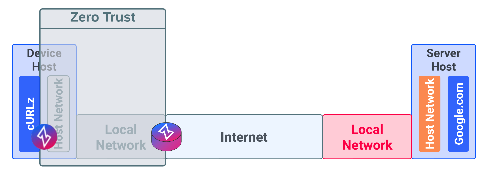
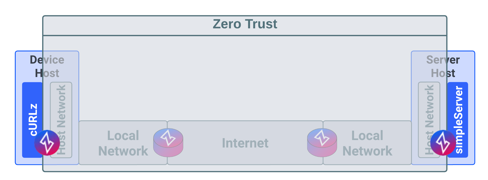

# Overview
This example is a zitified cURL (cURLz) example. In part 1 of this example, a call will be made to an endpoint which 
is not on the overlay network. In part 2, a call is made to an endpoint that *is* on the overlay network.

This example demonstrates:
* Dialing a service

## Requirements
* an OpenZiti network. If you do not have one, you can use one of the [quickstarts](https://openziti.github.io/ziti/quickstarts/quickstart-overview.html) to set one up.
* OpenZiti CLI to create services and identities on the OpenZiti Network

## Build the examples
Refer to the [example README](../README.md) to build the SDK examples

## Part 1: Set up a cURLz to a non-zitified endpoint
These steps will configure the service using the OpenZiti CLI. In this example, the traffic starts on the overlay zero 
trust network and then is offloaded onto the underlay network. 

### Part 1 Architecture Overview


At the end of these steps you will have created:
* a service called `web.endpoint`
* an identity to connect to (dial) the service
* the service config to connect the service to the overlay
* the service policies required to authorize the identities for bind and dial

Steps:
1. Log into OpenZiti. The host:port and username/password will vary depending on your network.

       ziti edge login localhost:1280 -u admin -p admin
1. Determine your edge router's name and populate this environment variable with it.

       ziti edge list edge-routers
       export ZITI_EDGE_ROUTER=<name-of-edge-router>
1. Run this script to create everything you need.

       echo Changing to build directory
       cd $ZITI_SDK_BUILD_DIR

       echo Create the service config
       ziti edge create config web.endpoint.hostv1 host.v1 '{"protocol":"tcp", "address":"www.google.com","port":'443'}'

       echo Create the service
       ziti edge create service web.endpoint --configs "web.endpoint.hostv1"
       
       echo Create an identity to make the dial request and enroll it
       ziti edge create identity user curlz -a clients -o curlz.jwt
       ziti edge enroll --jwt curlz.jwt
       
       echo Create service policies
       ziti edge create service-policy web.endpoint.dial Dial --service-roles "@web.endpoint" --identity-roles "#clients"
       ziti edge create service-policy web.endpoint.bind Bind --service-roles "@web.endpoint" --identity-roles "@${ZITI_EDGE_ROUTER}"
       
       echo Run policy advisor to check
       ziti edge policy-advisor services
1. Run the cURLz example for `web.endpoint`

       ./curlz https://web.endpoint curlz.json

### Example Output
The following is the output you'll see from the cURLz request to `web.endpoint`.
```
$ ./curlz https://web.endpoint curlz.json
<!doctype html><html itemscope="" itemtype="http://schema.org/WebPage" lang="en">
... <a lot of html code>
</body></html>
```

## Part 2: Set up a cURLz to a zitified endpoint
These steps will utilize the service and identities created in simple-server to provide an example of using cURLz with 
a zitified endpoint. In this example, the traffic never leaves the zero trust overlay. 

### Part 2 Architecture Overview


At the end of these steps you will have created:
* an identity to connect to (dial) the service

Steps:
1. Follow all steps in the simple-service example up to, and including, running the server but **do not** enroll the 
`simple-client` identity with the Ziti Desktop Edge client. We will do that with the CLI for this example
1. Open a new terminal and cd into the example build directory

       echo Changing to build directory
       cd $ZITI_SDK_BUILD_DIR
1. Run this script to create everything you need.

       echo Enroll the simple-client identity
       ziti edge enroll --jwt simple-client.jwt

1. Run the cURLz example for `simpleService`

       ./curlz http://simpleService simple-client.json

### Example Output
The following is the output you'll see from the cURLz request to `simpleService`.
```
$ ./curlz http://simpleService.ziti simple-client.json
Who are you?
```

## Teardown
Done with the example? This script will remove everything created during setup.
```
ziti edge login localhost:1280 -u admin -p admin

echo Removing service policies
ziti edge delete service-policy web.endpoint.dial
ziti edge delete service-policy web.endpoint.bind

echo Removing service config
ziti edge delete config web.endpoint.hostv1

echo Removing identity
ziti edge delete identity curlz

echo Removing service
ziti edge delete service web.endpoint
```
**NOTE:** If you followed **Part 2** of this example, refer to teardown in the `simple-server` [example README](../simple-server/README.md)
