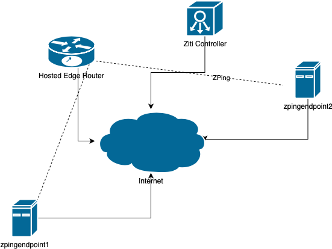

# zping  

`zping` provides equivalent functionality for an OpenZiti overlay network as the similarly named underlay function 
`ping`. Being a zero trust overlay network, classic underlay tooling like `ping` won't function properly.

`zping` provides end to end latency measurements between any two identities in an OpenZiti network. Like `icmp`, `zping`
will provide the following metrics upon completion of the ping session:

* min
* max
* mean latency
* standard deviation.

`zping` uses addressable terminators to direct ping requests to specific identities.

## Build the Example
Refer to the [example README](../README.md) to build the SDK examples

## Setup and Configure the Example

This README will use the `ziti edge quickstart` command for its example. You'll need the `ziti` CLI on your path to run
the commands shown. If you have an OpenZiti overlay network already, some commands will not be necessary. The 
commands all use bash and expect you're running on a version of *nix as `/tmp` is referenced. Adapt accordingly if 
you're using Windows. The example expects the binary to be put into the build directory as specified by the "Build 
the Example" section above.



1. Create or use an existing ziti network with at least one edge router. This can be accomplished easily by running

      ziti edge quickstart

   after the quickstart runs, you'll have an ephemeral network usable for testing.

1. Create at least two ziti identities and give them a common identity role i.e. #zping 

      ziti edge create identity client -o client.jwt -a "zping"
      ziti edge create identity server -o server.jwt -a "zping"
      ziti edge enroll client.jwt
      ziti edge enroll server.jwt

1. Create a simple sdk service named "ziti-ping". This is the default service name `zping` looks for. You can 
   override the service by using the `-s` flag.

      ziti edge create service ziti-ping

1. Create a bind policy with identityRoles set to [#zping] and serviceroles set to [@ziti-ping].

      ziti edge create service-policy zping.bind Bind --identity-roles "#zping" --service-roles "@ziti-ping"

1. Create a dial service policy with identityRoles set to [#zping] and serviceroles set to [@ziti-ping].
   
      ziti edge create service-policy zping.dial Dial --identity-roles "#zping" --service-roles "@ziti-ping"

1. Ensure that you have created appropriate edge-router and service-edge-router policies allowing the identities access
   edge-router(s) and the edge-routers access to the service. Verify by running policy-advisor. Both identities 
   should be able to dial **and** bind zping:

      $ ziti edge policy-advisor identities -q
      ERROR: Default Admin
        - Identity does not have access to any services. Adjust service policies.
   
      OKAY : client (1) -> ziti-ping (1) Common Routers: (1/1) Dial: Y Bind: N
      
      OKAY : server (1) -> ziti-ping (1) Common Routers: (1/1) Dial: Y Bind: N
      
      ERROR: quickstart-router
        - Identity does not have access to any services. Adjust service policies.

1. In one window run the server
```
    build/zping server -c server.json
```
      example:
      ```
      $ build/zping server -c server.json
      INFO[0000] binding service ziti-ping
  
      0xc00040d660 now serving
  
      INFO[0000] new service session                           session token=52e059d2-f166-4561-b5a4-b42056bcd787
      INFO[0041] new connection
      ```

1. In another window run the client
```
    build/zping client -c client.json -i server
```
      
      ```
       $ build/zping client -c client.json -i server
  
      Sending 100 byte pings to server:
      
      100 bytes from server: ziti_seq=1 time=0.609ms
      100 bytes from server: ziti_seq=2 time=0.670ms
      100 bytes from server: ziti_seq=3 time=0.381ms
      100 bytes from server: ziti_seq=4 time=0.387ms
      100 bytes from server: ziti_seq=5 time=0.564ms
      100 bytes from server: ziti_seq=6 time=0.455ms
      100 bytes from server: ziti_seq=7 time=0.446ms
      100 bytes from server: ziti_seq=8 time=0.377ms
      100 bytes from server: ziti_seq=9 time=0.455ms
      100 bytes from server: ziti_seq=10 time=0.502ms
      100 bytes from server: ziti_seq=11 time=0.977ms
      100 bytes from server: ziti_seq=12 time=0.487ms
      ^C
      --- server ping statistics ---
      12 packets transmitted and 12 packets received, 0.00% packet loss
      round-trip min/max/avg/stddev 0.377/0.977/0.526/0.162 ms
      ```

1. Send 5 zpings from the client to the server using `-n 5`
```
$ build/zping client -c client.json -i server -n 5

Sending 100 byte pings to server:

100 bytes from server: ziti_seq=1 time=0.349ms
100 bytes from server: ziti_seq=2 time=0.690ms
100 bytes from server: ziti_seq=3 time=0.590ms
100 bytes from server: ziti_seq=4 time=0.429ms
100 bytes from server: ziti_seq=5 time=0.480ms

--- server ping statistics ---
5 packets transmitted and 5 packets received, 0.00% packet loss
round-trip min/max/avg/stddev 0.349/0.690/0.508/0.120 ms
```
